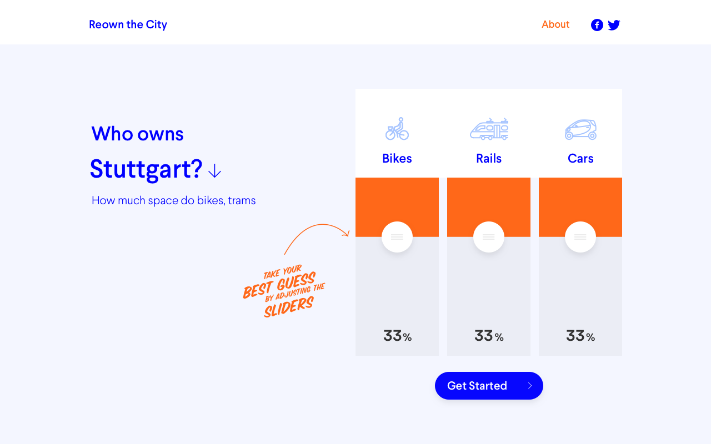
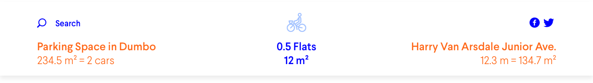
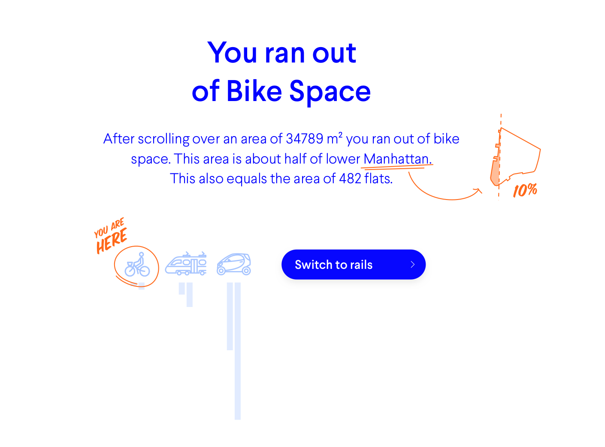
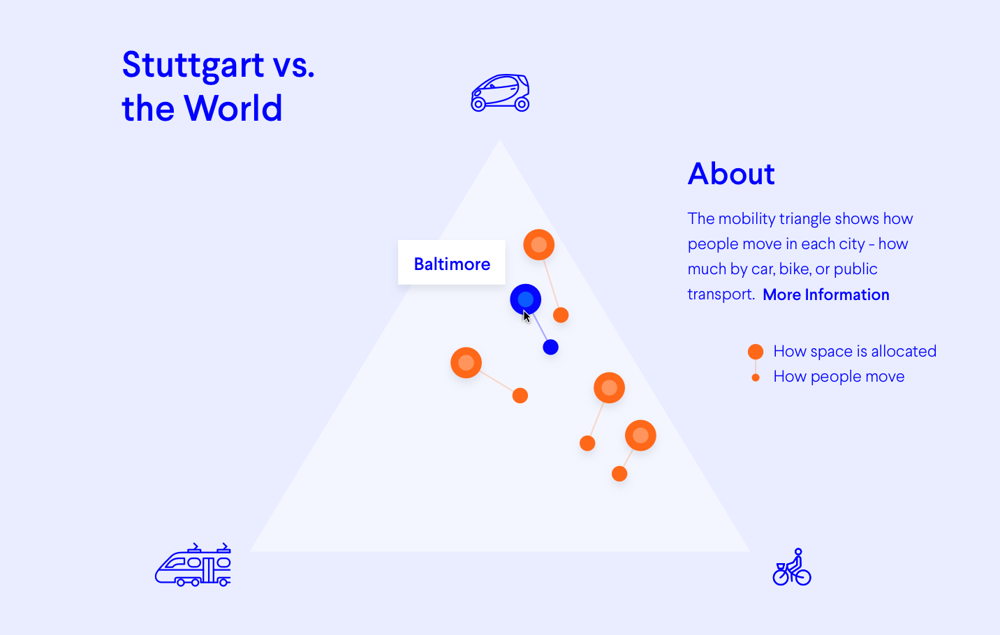
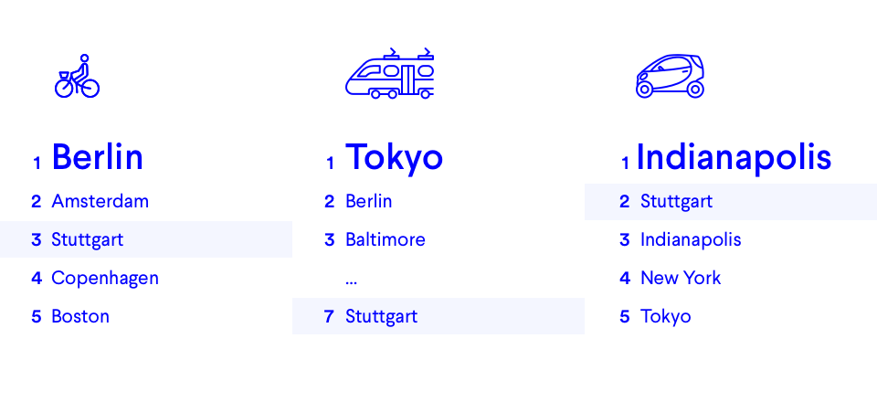

# Probable Questions
This document should explain the theory behind the different sections and hopefully clears questions before they arrive.

## URL Structure
The Website should allow deep linking to any section.

### General
- **whatthestreet.com/{cityname}/{section}**
- e.g. **whatthestreet.com/berlin/about**

### For the street/parking space/rail detail view
- **whatthestreet.com/{cityname}/{section}/{type of mobility}/{type of space}/{id}**
- e.g. **whatthestreet.com/berlin/spaces/bike/parking/15**

**Note:** This is more of a proposal – let us know if this would lead to problems.

## Landing Screen

The sliders all start with equal values (33% / 33% / 33% will be displayed even if they are actually 33% / 34% / 33%), so the user's selection will not be biased.
If you drag one slider, they always some up to 100%, so the other two sliders adjust automatically. See this [example](http://jsfiddle.net/tyjJx/3/).

The user has to adjust a slider before he can press "Get Started" (maybe even hide the button until the user adjusts a slider).

## Scroll Header


The header counts how much space is allocated. The left shows the currently selected parking space/rail and the right the currently selected rail/street.

### General
The svgs contain certain meta tags (e.g. size, name, etc.). You can read those to get the values you need to display. Please only display one decimal always (add '.0' if the number is exact).

### Combined Space
The number in the center is the space, since you started scrolling (everything above the orange line) and is calculated by summing up the value in the tag **moovel\_cumulative_area** of both svgs.

The comparison values (e.g. "Flats") are defined in **comparisonSizes.json**. Use always the lower value until it reaches the next larger comparison (use _playground_ until the size equals 1.0 _soccer fields_).

### Individual Space
The value **moovel_area** in the svg. For parking spaces please display how many cars/bikes/wagons this would approximately would be (see **defaultParkingSpaceSize.json** for values).

### Which name to pick?
1. Use **moovel_name** if present (e.g. "Hollywood Boulevard"), otherwise ...
2. Use **moovel_neighborhood** in combination with the **type of mobility** (e.g. "Street in Dumbo" / "Biketrack in Dumbo" / "Railtrack in Dumbo"), otherwise ...
3. Use the **type of mobility** in combination with the **city name** (e.g. "Street in New York" / "Biketrack in New York" / "Railtrack in New York")

## Scroll End

Please use the area values in **citymetadata.json** to compute the lengths of the bars.

- bike 
	- left column: parking.bike.area
	- right column: moving.bike.area
- car
	- left column: parking.car.offStreet.area
	- right column: moving.car.area
- rail
	- left column: parking.rail.area
	- right column: moving.rail.area

Divide the number by something like 1 000 000 and use as height (e.g. bike 4623361.1 / 1000000 -> 4.623361 -> height (rounded) 5 px)

## Guesses
### 1st Diagram
There are two options. Which one to display, depends on what the user chose in the beginning.

- If the guess was very close to the real sizes, pick **5\_YourGuess_Great** (in the sketch file)
- Otherwise use **5\_YourGuess_Otherwise**

Every option has also the option to share the outcome – see also the sketch file for prefilled text.

### 2nd Diagram
Here you have three options. As in the 1st diagram, they depend on the choice in the beginning.

Your choice is compared to other people's choices. 

- If you guessed better than most, show **6\_Comparison_Great**
- If it's average, show **6\_Comparison_Average**
- Otherwise, show **6\_Comparison_Terrible**

## About [City]
### Longest Streets
These are defined in **citymetadata.json**

### Longest Street Names
These are defined in **citymetadata.json**

### Citizen Ownership
Have to be calculated. 

#### Example
- Bike Lanes: **moving.bike.length** / **population** (citymetadata.json)
- Rails: **moving.rail.length** / **population** (citymetadata.json)
- Road: **moving.car.length** / **population** (citymetadata.json)
- Bike Parking: **space.bike** / **population** (citymetadata.json) / **areaOfBike** (defaultParkingSpaceSize.json)
- Rail Parking: **rail** / **population** (citymetadata.json) / **areaOfRail** (defaultParkingSpaceSize.json)
- Car Parking: **space.car** / **population** (citymetadata.json) / **areaOfCar** (defaultParkingSpaceSize.json)

### Background
If for a city a background image is not available, use `#6894ED` (but also let us know when a city is missing – thanks).

## [City] vs. the World
### Mobility Triangle

There are two type of dots in the [Ternary Plot](https://en.wikipedia.org/wiki/Ternary_plot). A small one and a big one. The small one shows how people move through the city (**modalsplit** in **citymetadata.json**) and the large one shows how space is allocated (**space** in **citymetadata.json**).

Code Example

````
console.log();
console.log('Examples');
console.log();
console.log('- All Bike (dot bottom right)');
console.log('   ', mobilityTriangle(1123, 0, 0) );
console.log();
console.log('- All Car (dot top)');
console.log('   ', mobilityTriangle(0, 124, 0) );
console.log();
console.log('- All Rail (dot bottom left)');
console.log('   ', mobilityTriangle(0, 0, 647) );
console.log();
console.log('- Balanced (dot in center)');
console.log('   ', mobilityTriangle(25, 25, 25) );
console.log();
console.log('- More realistic example');
console.log('   ', mobilityTriangle(15, 231, 45) );

function mobilityTriangle(bike, car, rail) {
    return coordinateInTriangle(bike, car, rail);
}

function coordinateInTriangle(a, b, c, edgeLength) {
    edgeLength = edgeLength || 1;
    // See https://en.wikipedia.org/wiki/Ternary_plot
    var sum = a + b + c;
    var fractionA = a / sum;
    var fractionB = b / sum;
    var fractionC = c / sum;

    var y = fractionB * Math.sin(toRadians(60));
    var x = fractionA + y * cot(toRadians(60));
    return {
        "x": x * edgeLength,
        "y": y * edgeLength
    }
}

function toRadians(degrees) {
    return degrees * Math.PI / 180;
}

function toDegrees(radians) {
    return radians / Math.PI * 180;
}

function cot(x) {
    return 1 / Math.tan(x);
}
````

### High Score

This is just a simpler view of the mobility triangle. It lists cities with the most space per type of mobility

If the currently selected city is among the top 5, list it normally. If would be further down the list, display position 4 as "..." and display the number where it would be in the rank (see image for reference).

## Future City
The icon for cars on the road is always 1, but the number it shows is specific for each city – always a certain fraction of **cars** in **citymetadata.json**. (See below)

There are 35000 cars and 2.5% are driving in any moment (on average).
This means the 1 driving icon stands for 875 cars. It also means that the rest of the cars (34125) are parking and are resembled in 39 icons (34125 divided by 875). 

Only 7% percent of today's car parking will be needed in the future, the right column has 3 car icons (34125*0.07/875 = 2.73).

### Summary:
- Number of cars in city (see **cars** in **citymetadata.json**)
- Number of cars on road (now and future the same): **number of cars** * **2.5%**
- Number of cars parking (today): **Number of cars** - **Number of cars on road**
- Number of cars parking (future): **Number of cars parking (today)** * **7%**
- Parking Spaces that could be freed up: **Number of cars parking (today)** - **Number of cars parking (future)**

### Landmarks
Landmark assets are scaled to fit the description you just read